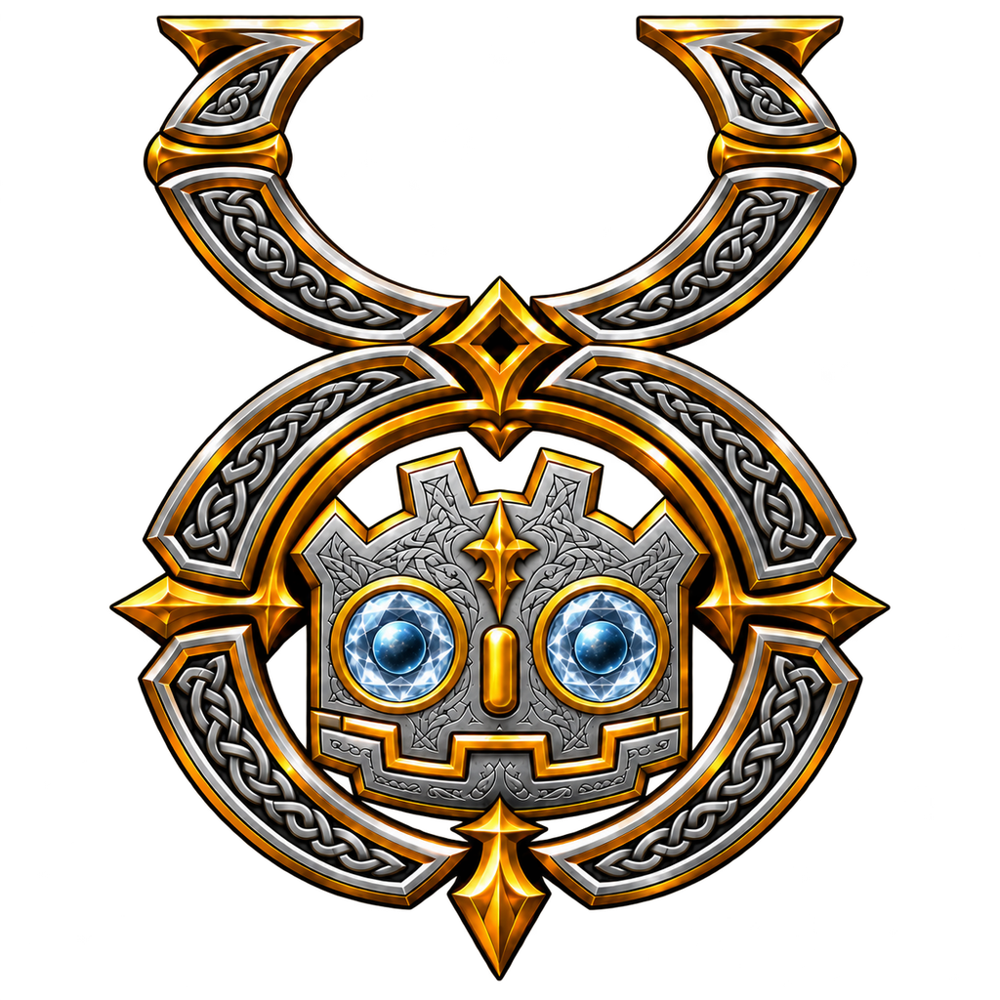
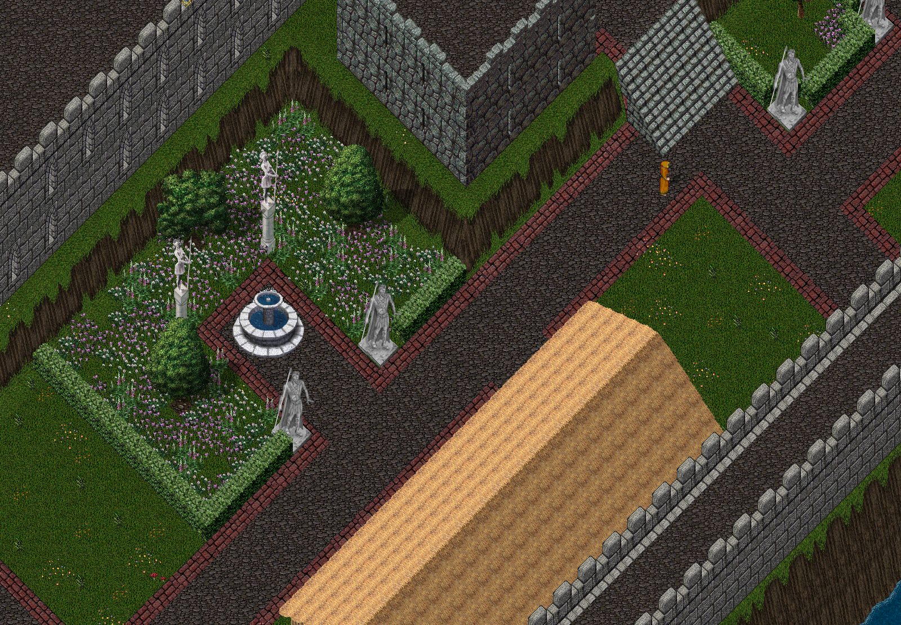

# GodotUO

<p align="center">
  
</p>

**GodotUO** (GUO in the code) ports **Classic Ultima Online** to **Godot 4
.NET** — getting the client off FNA while keeping the game behaviour intact.



The strategy is a transplant rather than a rewrite: [ClassicUO](https://github.com/ClassicUO/ClassicUO)'s
C# network stack, file readers and game logic are carried across; only the
parts that genuinely bind to FNA are reimplemented on Godot.

> **You supply your own Ultima Online installation.** No game data is
> distributed with this project. The client reads your install in place and
> never writes to it.

---

## Status

**Pre-release. Playable on a local shard; not yet at parity.**

- Every upstream file is ported, by the audit's count (`docs/port_status.md`).
  "Ported" means present and compiling, not proven working.
- Against a ModernUO dev shard it logs in, walks the world and opens gumps,
  and it hosts assistant plugins through upstream's plugin interface.
- The last side-by-side sweep against ClassicUO (`docs/parity_2026-09-23.md`)
  matched in five of eight places. The other three show known rendering
  differences, listed there with their causes.
- Windows, and an Android ARM64 debug build that has run on one device
  (`docs/architecture/ADR-0017-android-target.md`). A web build is blocked
  upstream: Godot 4.7 .NET cannot export C# to the web
  (`docs/architecture/ADR-0008-web-target.md`).

Bug reports that compare GUO against ClassicUO in the same place are the most
useful thing you can send. See `CONTRIBUTING.md`.

---

## Requirements

| | |
|---|---|
| **Windows** | 10 or 11, x64 |
| **Godot** | 4.7.2 stable, **mono/.NET** build — fetched by the bootstrap step |
| **.NET SDK** | 8.0 for the desktop client (`net8.0`); 9.0 for the Android export, where `GUO.csproj` switches to `net9.0`; 10.0 for the dev shard and the parity tools |
| **Python** | 3.12+ (tooling) |
| **A UO client install** | Any modern Classic client; developed against 7.0.107 |

---

## Getting started

```bat
REM 1. Fetch the pinned engine and the upstream reference
launchers\pipeline\00_bootstrap.bat

REM 2. Point the project at your UO install (this file is yours; it is gitignored)
copy launchers\_shared\config.local.bat.example launchers\_shared\config.local.bat
notepad launchers\_shared\config.local.bat

REM 3. Confirm everything resolves
launchers\dev\smoke.bat

REM 4. Run it
launchers\game\play.bat
```

It connects to `127.0.0.1:2593` by default. To run a local
[ModernUO](https://github.com/modernuo/ModernUO) shard to play against, see
`tools/modernuo/README.md`; to play elsewhere, set `UO_SHARD_HOST` and
`UO_SHARD_PORT` in your `config.local.bat`.

Optionally add the engine folder to `PATH` so `godot` resolves everywhere:

```
<your clone>\tools\godot
```

Use `godot` for the interactive editor and **`godot-console` for scripts and
CI** — the console build blocks and writes to stdout.

---

## Documentation

The wiki lives in the repository, under [`docs/wiki/`](docs/wiki/Home.md), so
it is versioned and reviewed with the code: getting started, every
configuration key, the launchers and tools, the Windows and Android builds,
the dev shard, the editor, the scripted runs and probes, parity and drift,
the ADR index and a FAQ. `docs/wiki/README.md` says how it is published to
the GitHub Wiki. The plan (`docs/port_plan.md`), the data contract
(`docs/data_formats.md`) and the ADRs (`docs/architecture/`) remain the
sources it is written from.

---

## Layout

```
launchers/        .bat entry points grouped by job — start here
  _shared/        config.local.bat (yours) + config.bat (defaults) + common.bat
  game/play.bat   THE launcher
  pipeline/       numbered data steps, run in order
  shard/          the local ModernUO dev shard
  dev/            build, smoke, screenshot, parity, upstream sync
godot/GUO/        the Godot project (C#)
  src/Compat/     XNA compatibility shim
sources/ClassicUO/  upstream reference — read only, not committed
tools/            one folder per job, plus the pinned engine
docs/             the plan, the data contract, generated status, ADRs
```

---

## How the port is tracked

Every upstream file is classified by how tightly it binds to FNA, and the
audit re-measures it from source on demand:

```bat
launchers\pipeline\03_port_audit.bat     REM writes docs/port_status.md
```

| Tier | Files | Lines | Treatment |
|---|---:|---:|---|
| `verbatim` | 247 | 74,760 | Renamespace and compile |
| `shim` | 116 | 56,510 | Swap `using` to `GUO.Compat` |
| `rewrite` | 37 | 21,959 | Reimplement on Godot |

About **80% of the port is mechanical** — most of ClassicUO's FNA usage turns
out to be maths and colour structs, not rendering. `GUO.Compat` supplies
API-compatible versions of those, so a third of the codebase needs one line
changed per file.

`docs/port_plan.md` explains the reasoning and the phase order.

---

## Keeping up with upstream

ClassicUO is actively developed. This reports commits since the last reviewed
pin, and flags any touching files already ported:

```bat
launchers\dev\sync_upstream.bat
```

---

## Licensing

GUO is licensed under the **BSD 2-Clause** licence (`LICENSE`), the same as
ClassicUO, from which most of its code is ported.

| Component | Licence |
|---|---|
| This repository | BSD 2-Clause |
| [ClassicUO](https://github.com/ClassicUO/ClassicUO) | BSD 2-Clause — ported files keep their upstream headers; licence text in `docs/upstream/` |
| `tools/modernuo/patches/` | GPL-3.0 — they modify [ModernUO](https://github.com/modernuo/ModernUO), which is not redistributed |
| `.claude/` agents and skills | MIT — adapted from [Claude Code Game Studios](https://github.com/Donchitos/Claude-Code-Game-Studios) |
| [Godot](https://godotengine.org) | MIT — fetched, not redistributed |
| **UO client data** | Proprietary. Never redistributed; supply your own. |

---

## Disclaimer

Ultima Online is a registered trademark of Electronic Arts Inc. GUO is an
unofficial, fan-made project. It is not affiliated with, endorsed by, or
associated with Electronic Arts or Broadsword Online Games, and it contains
none of their game data.
